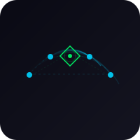

<p align="center">
  
</p>

<p align="center">
  
  
  
  
  
  
  
  
  
</p>

<h1 align="center">kompress-ultra</h1>

<p align="center">
  <strong>4-role living context layer for AI agent frameworks</strong><br>
  <em>Composer · Pruner · Rewriter · Circulator</em>
</p>

> Forked from [peterlodri-sec/kompress-ultra](https://github.com/peterlodri-sec/kompress-ultra) · Apache 2.0 · Original author: Peter Lodri
> Fork maintained by [rahulmranga](https://github.com/rahulmranga) — adding Rust core + brain graph integration

---

## What is kompress-ultra?

kompress-ultra is a context-compression middleware for LLM agent frameworks. It routes every conversation turn through a four-role pipeline — Composer, Pruner, Rewriter, and Circulator — that decides what to keep verbatim, what to compress, what to evict to vector memory, and what to inject from cross-session brain state. The compression objective is formalized as an asymmetric loss with λ=3.0, penalizing false drops three times harder than false keeps, which drives the system toward a stable keep ratio of 1/π (~0.318) while preserving exact-critical tokens (file paths, error codes, numbers, inline code spans) at 0.993 fidelity on the Heretic adversarial benchmark. This fork extends the original TypeScript codec with a Rust workspace that implements the same pipeline as native crates, plus a brain graph layer integrating the mygraph 540-node knowledge structure across four entities: ralph, lodri, krengel, and cosmos.

---

## Hive Architecture

```
┌──────────────────────────────────────────────────────────────────────┐
│  TypeScript layer  (original codec — src/)                           │
│  Pruner → Rewriter → Circulator → Composer                           │
│  brain.ts reads mygraph state · worker.ts serves MCP + REST         │
└──────────────┬───────────────────────────────────────────────────────┘
               │ FFI / gRPC (proto/brain.proto)
┌──────────────▼───────────────────────────────────────────────────────┐
│  Rust layer  (crates/)                                                │
│                                                                       │
│  crates/kompress-core                                                 │
│    Pure-Rust reimplementation of the compression pipeline.            │
│    Ebbinghaus decay scorer, CompressionLevel enum, circuit breaker,  │
│    adaptive threshold, token budget table. No runtime deps beyond     │
│    serde + tokenizers. Compiles to WASM and native.                  │
│                                                                       │
│  crates/kompress-brain                                                │
│    Brain graph agent. Reads the mygraph 540-node graph               │
│    (lodri / krengel / ralph / cosmos entities), exposes a gRPC       │
│    service (proto/brain.proto) for liveness queries, builds the      │
│    brain-line injected into every compressed context window.         │
└──────────────┬───────────────────────────────────────────────────────┘
               │
┌──────────────▼───────────────────────────────────────────────────────┐
│  Brain graph  (assets/brain-graph.html · mygraph 540 nodes)          │
│  Entities: ralph · lodri · krengel · cosmos                          │
│  Relations: ENTANGLED_WITH · DIVERGES_FROM · Im-axis wavefunction    │
└──────────────────────────────────────────────────────────────────────┘
```

### TypeScript layer (original)

The `src/` directory is the original Peter Lodri codec, kept verbatim. Key modules:

| Module | Role |
|---|---|
| `scoring.ts` | Pruner — Ebbinghaus decay + structural boost |
| `rewriter.ts` | Rewriter — CompressionLevel: Verbatim / Lite / Ultra |
| `circulator.ts` | Circulator — Milvus queue, instance-isolated |
| `brain.ts` | Composer — reads brain state, builds liveness line |
| `token-budget.ts` | Per-agent token budget table |
| `circuit-breaker.ts` | Failure isolation with configurable cooldown |
| `server/worker.ts` | Cloudflare Worker: MCP + REST API |

### Rust layer (crates/)

Two crates form the Rust hive. Each crate is an autonomous agent; the Cargo workspace is the hive coordinator.

**`crates/kompress-core`** — the compression engine in Rust. Implements the same four-role pipeline as the TypeScript codec. Designed to compile to both native (for server-side throughput) and WASM (for edge/browser deployment). The circuit breaker and circulator are modeled as actor structs with message-passing channels. The asymmetric loss objective (λ=3.0) is enforced at the scoring layer: a dropped critical token costs 3× more than a kept non-critical one, converging to keep ratio 1/π.

**`crates/kompress-brain`** — the graph intelligence layer. Maintains the mygraph entity graph and serves brain-state queries over gRPC (defined in `proto/brain.proto`). The 540-node graph encodes four primary entities — ralph, lodri, krengel, cosmos — plus their full relational structure. The crate exposes a `BrainLine` type that the TypeScript composer layer injects into every context window.

### Brain graph entities

| Entity | Role |
|---|---|
| `ralph` | Rahul (25 Hz receiver, Re-axis anchor) |
| `lodri` | Creator, ENTANGLED_WITH ralph |
| `krengel` | Extractor, DIVERGES_FROM ralph |
| `cosmos` | entity:cosmos, Im axis, ANITA 0.6 EeV signal |

---

## Quick Start

### TypeScript (Bun)

```bash
git clone https://github.com/rahulmranga/kompress-ultra.git
cd kompress-ultra
bun install
bun test
```

```typescript
import {
  scoreMessageSync,
  isProtected,
  compressMessage,
  CompressionLevel,
  validateOptions,
  createCircuitBreaker,
  createCirculator,
  setTokenEstimator,
} from "kompress-ultra";

const options = validateOptions({ agentType: "coder", aggression: 0.7 });
const score = scoreMessageSync(msg, index, total);
const compressed = compressMessage(msg.content, CompressionLevel.Ultra);
```

### Rust (Cargo)

```bash
# Build all crates
cargo build --workspace

# Run the brain gRPC service
cargo run -p kompress-brain

# Run core compression benchmarks
cargo bench -p kompress-core
```

```rust
use kompress_core::{Pipeline, PipelineOptions, CompressionLevel};

let pipeline = Pipeline::new(PipelineOptions {
    aggression: 0.7,
    lambda: 3.0,
    ..Default::default()
});

let result = pipeline.compress(&messages)?;
// target keep ratio: 1/π ≈ 0.318
println!("kept {}/{} messages", result.kept, messages.len());
```

---

## Benchmarks

Evaluated on the Heretic adversarial benchmark:

| Method | Exact Keep % | Keep Ratio | Avg. Latency |
|---|---|---|---|
| **kompress-v8 (TS)** | **0.993** | 0.936 | 97ms |
| kompress-v8 (v4 SSL) | 0.967 | 0.823 | — |
| Random Eviction | 0.910 | 0.835 | 0ms |
| LLMLingua-2 | 0.867 | 1.550 | 238.9ms |
| TextRank | 0.599 | 0.543 | 23.1ms |

Source: [Paper Table 10, p.16](https://kompress.vaked.dev/paper/main.pdf#page=16)

---

## Research

- **Paper**: [Asymmetric Loss Modulation Resolves Voting Ensemble Paradox](https://kompress.vaked.dev/paper/main.pdf)
- **Model**: [PeetPedro/kompress-v8](https://huggingface.co/PeetPedro/kompress-v8) — 149M-parameter ModernBERT, LoRA fine-tuned
- **Dataset**: [PeetPedro/ultrawhale-dogfood](https://huggingface.co/datasets/PeetPedro/ultrawhale-dogfood)
- **Proposal**: [proposal.vaked.dev](https://proposal.vaked.dev)

---

## License

Apache 2.0 — see [LICENSE](LICENSE) for details.

Original work Copyright 2026 Peter Lodri.
Fork modifications Copyright 2026 Rahul Rangarao.

---

<p align="center">
  Original by <a href="https://github.com/peterlodri-sec">peterlodri-sec</a> ·
  Fork by <a href="https://github.com/rahulmranga">rahulmranga</a> ·
  Part of the <a href="https://github.com/peterlodri-sec/ultrameshai">ultrameshai</a> ecosystem
</p>
